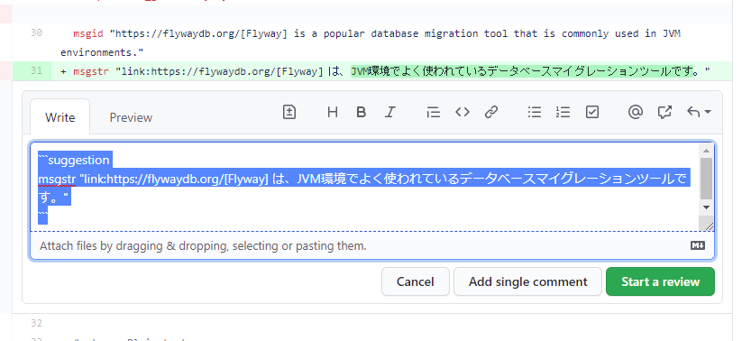
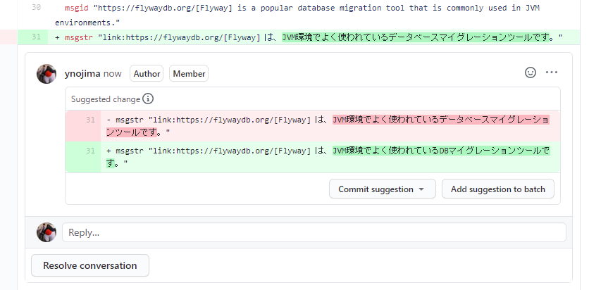

# quarkus.io 翻译项目审核指南

在quarkus.io翻译项目中，从待翻译的文档中提取文本，转换成翻译文件（.po文件）格式，由git管理。存储库托管在 GitHub 上，新翻译的文本将作为 Pull Request 发送到 GitHub 存储库，由审阅者审阅，然后合并到存储库中。本指南将解释审阅者在审阅期间将采取的具体步骤。

## 审查程序

### 打开拉取请求

可以从[项目页面](https://github.com/quarkusio/cn.quarkus.io)的“Pull Requests”选项卡中查看 Pull Requests列表。从列表中选择拉取请求以打开拉取请求页面。拉取请求页面上有几个子选项卡。

### 对话选项卡

“对话”选项卡显示拉取请求的描述和评论。当基于 Pull Request 构建预览站点时，会在此处添加一个 URL 链接，因此请在审阅时查看此链接的预览。

### 文件已更改选项卡

在“文件改变”标签中，你会看到在Pull Request中所做的改变。.po文件会显示为原始文本文件。从标签菜单的齿轮按钮可以切换1列显示中显示变更点的“Unified”视图和左右2列显示中以变更前·变更后的形式显示变更点的“Split”视图。

### 添加内联注释

如果您想讨论修复（是否适合翻译术语等），您可以在 Files Changed 选项卡上的每一行添加注释。当您将鼠标悬停在“文件已更改”选项卡上要添加注释的行上时，左侧将显示一个蓝色的“+”按钮。在按下该按钮打开的输入表单中输入注释。有两个提交按钮，“添加单条评论”和“开始评论”，但是“添加单条评论”按钮添加为单条评论，“开始评论”按钮合并了多条评论。评论暂时保存在Pending 状态以便发送它。

### 添加更改提案评论

如果您需要修改翻译并想提出修改建议，请从要修改的行左侧的蓝色“+”按钮打开内联注释输入表单，然后在输入表单中按“±”按钮菜单。将自动插入建议对目标行进行更正的注释符号，因此请更正翻译并发送。

### 变更提案评论的反映

更改建议评论如下图所示，您可以通过点击“提交建议”按钮当场将更改应用到 Pull Request。

如果您认为自己愿意进行更正无可争议，请反映更改。“将建议添加到批处理”按钮是用于在一次提交中应用更改的按钮。

### 审核完成

如果您按下右上角的“审核更改”按钮（或“完成您的审核”按钮），评论字段将打开，您可以将其作为审核结果批准、请求更正或发表评论。如果有处于 Pending 状态的评论，则此时将它们一起添加。

### 合并

审核完毕，判断导入仓库没有问题后，点击“Conversation”选项卡底部的“Merge pull request”按钮进行合并。合并完成后，如果合并目标是主分支，则站点的构建将开始，并将在大约 10 分钟后反映在站点上。

## 小窍门

### 如果你想在review的时候在本地修改Pull Request

如果你想直接在本地修改作为审阅者正在审阅 gh的Pull Request，使用命令在本地签出Pull Request分支，修改后重新创建为新的Pull Request。也是可以的。如果您习惯于从命令行工作，请尝试一下。 gh按照命令[安装程序](https://github.com/cli/cli#installation)进行安装，然后按照从 Pull Request 页面上的“打开方式”按钮打开的“GitHub CLI”上的检出程序进行检出。

